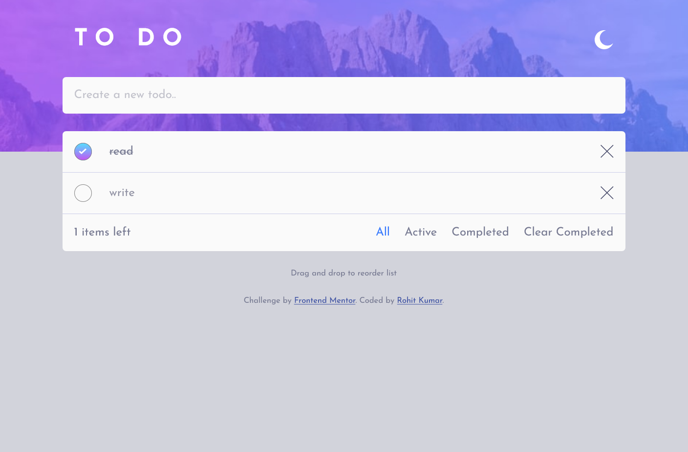
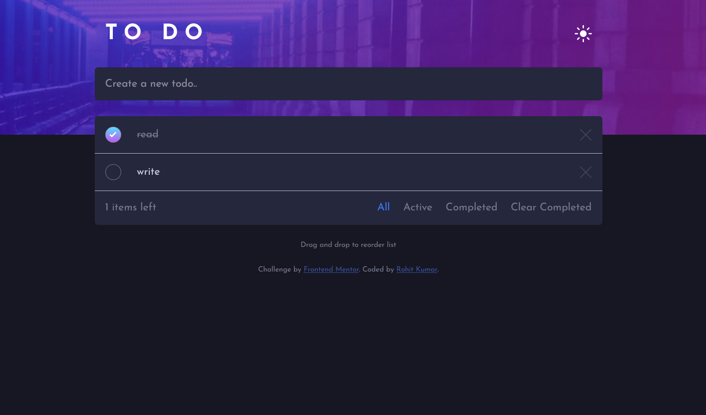

# Frontend Mentor - Todo app solution

This is a solution to the [Todo app challenge on Frontend Mentor](https://www.frontendmentor.io/challenges/todo-app-Su1_KokOW). Frontend Mentor challenges help you improve your coding skills by building realistic projects.

## Table of contents

- [Overview](#overview)
  - [The challenge](#the-challenge)
  - [Screenshot](#screenshot)
  - [Links](#links)
- [My process](#my-process)
  - [Built with](#built-with)
  - [What I learned](#what-i-learned)
  - [Continued development](#continued-development)
  - [Useful resources](#useful-resources)
- [Author](#author)

## Overview

### The challenge

Users should be able to:

- View the optimal layout for the app depending on their device's screen size
- See hover states for all interactive elements on the page
- Add new todos to the list
- Mark todos as complete
- Delete todos from the list
- Filter by all/active/complete todos
- Clear all completed todos
- Toggle light and dark mode
- **Bonus**: Drag and drop to reorder items on the list

### Screenshot

#### Light Mode



#### Dark Mode



### Links

- Solution URL: [Github repo](https://github.com/rohitKumar38344/Todo-app)
- Live Site URL: [Netlify](https://tasktofinish.netlify.app/)

## My process

### Built with

- Semantic HTML5 markup
- CSS custom properties
- Flexbox
- CSS Grid
- Mobile-first workflow
- JavaScript

### What I learned

I learned the use of css variables which helps me in building the dark and light mode feature.

```css
:root {
  --body-bg-color: hsl(235, 21%, 11%);
  --user-input-bg: hsl(235, 24%, 19%);
  --input-text-color: #fff;
  --placeholder-text-color: hsl(236, 33%, 92%);
  --task-active-color: hsl(234, 39%, 85%);
}

body {
  background-color: var(--body-bg-color);
}
```

### Continued development

I wanted to add backend to this project to store todo's in database.

### Useful resources

- [javascript info](https://javascript.info/) - This helped me to learn drag and drop functionality in the project.

## Author

- Website - [RohitKumar](https://github.com/rohitKumar38344)
- Frontend Mentor - [@rohitKumar38344](https://www.frontendmentor.io/profile/rohitKumar38344)
- Twitter - [@\_iamrohitKumar](https://twitter.com/_iamrohitKumar)
